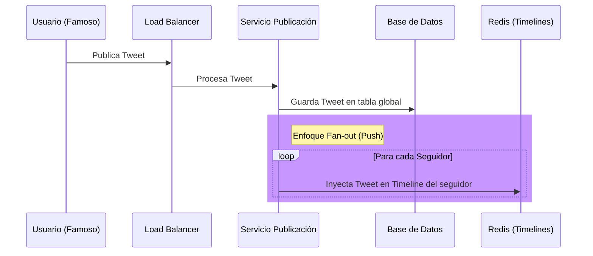

# 🧱 Capítulo 1: Fiabilidad, Escalabilidad y Mantenibilidad

> **Basado en:** _Designing Data-Intensive Applications_ de Martin Kleppmann.
> **Nivel:** Fundamental
> **Serie:** De Senior a Staff Engineer

Este documento resume los tres pilares fundamentales que distinguen a una aplicación de juguete de un sistema de producción a gran escala.

---

## 📺 Video Explicativo

_Haz clic en la imagen para ver la explicación completa y el dibujo en vivo._

---

## 1. 🛡️ Fiabilidad (Reliability)

**"El sistema continúa funcionando correctamente incluso cuando ocurren adversidades."**

No se trata de evitar que las cosas fallen (es imposible), sino de evitar que esos fallos rompan la experiencia del usuario.

### Conceptos Clave

- **Fallo (Fault) vs. Falla (Failure):**
  - _Fallo:_ Un componente se desvía de su especificación (ej. un disco duro muere, una excepción de red).
  - _Falla:_ El sistema entero deja de dar servicio al usuario.
  - **Meta:** Diseñar sistemas tolerantes a fallos para prevenir fallas.
- **Tipos de Fallos:**
  1.  **Hardware:** Discos, RAM, cortes de luz. (MTTF - Mean Time To Failure).
  2.  **Software:** Bugs, procesos fuera de control, cascadas de errores.
  3.  **Humanos:** La causa #1. Configuraciones erróneas, despliegues fallidos.

> **💡 Insight:** Netflix usa _Chaos Monkey_ para causar fallos intencionales y asegurar que sus sistemas automáticos de recuperación funcionen.

---

## 2. 📈 Escalabilidad (Scalability)

**"La capacidad de un sistema para manejar una carga creciente."**

La escalabilidad no es un botón mágico; es una decisión de arquitectura basada en **Parámetros de Carga**.

### ¿Cómo medimos la carga?

Depende de tu sistema:

- **Twitter / X:** Requests por segundo (Escritura vs Lectura).
- **Base de Datos:** Ratio de Lecturas/Escrituras.
- **Chat:** Usuarios concurrentes activos.

### El Caso de Estudio: Twitter (Fan-out)

El reto de Twitter no es publicar un tweet, es entregar ese tweet a los 10 millones de seguidores de un famoso en milisegundos.

## 3. 🔧 Mantenibilidad (Maintainability)

"La facilidad con la que diferentes ingenieros pueden trabajar en el sistema a lo largo del tiempo."

Es el pilar olvidado, pero el más costoso económicamente. Se divide en:

- **Operabilidad**: Hacerle la vida fácil al equipo de DevOps/SRE. (Buenos logs, métricas, documentación).
- **Simplicidad**: Eliminar la Complejidad Accidental. No uses Kubernetes si un VPS basta.
- **Evolubilidad**: La facilidad para hacer cambios en el futuro (Agilidad).

## El Ángulo Frontend / Fullstack

¿Por qué te debe importar esto si trabajas con React/Next.js?

| Concepto       | Aplicación en Frontend                                                                                       |
| -------------- | ------------------------------------------------------------------------------------------------------------ |
| Fiabilidad     | ¿Tu UI maneja errores con ErrorBoundaries o se pone en blanco? ¿Usas Optimistic UI para ocultar latencia?    |
| Escalabilidad  | ¿Estás bloqueando el Main Thread? ¿Usas CDN para assets estáticos? ¿Paginación vs Infinite Scroll mal hecho? |
| Mantenibilidad | "TypeScript estricto, Design Systems, Storybook. Código que tu ""yo del futuro"" entienda."                  |

## 🧠 Preguntas de Mock Interview

### 1. Si un disco duro falla en uno de tus servidores de base de datos, ¿es esto un "Fallo" (Fault) o una "Falla" (Failure)? Explica la diferencia.

**Respuesta Esperada:**
Es un **Fallo (Fault)**.

- **Fallo:** Es cuando un componente individual del sistema (hardware o software) se desvía de su especificación.
- **Falla (Failure):** Es cuando el sistema completo deja de prestar servicio al usuario final.
- **El objetivo del System Design:** Diseñar sistemas que toleren _fallos_ (como que se queme un disco) para evitar _fallas_ (que el sitio se caiga).
  > **Staff Insight:** "En la nube, los fallos son la norma, no la excepción. Por eso herramientas como _Chaos Monkey_ de Netflix provocan fallos a propósito: para entrenar al sistema a no colapsar."

### 2. En el caso de estudio de Twitter, ¿por qué el enfoque de "Fan-out on Write" (Push) es problemático para usuarios con millones de seguidores (ej. Justin Bieber)?

**Respuesta Esperada:**
El problema es la **Latencia de Escritura**.
En el modelo _Fan-out on Write_, cuando un usuario publica, el sistema debe insertar ese tweet en el "Timeline Cache" de _todos_ sus seguidores.

- Para un usuario normal (300 seguidores), es instantáneo.
- Para una celebridad (100 millones de seguidores), el sistema tendría que hacer 100 millones de escrituras en milisegundos. Esto causa el "Twitter Whale" (retrasos masivos).
- **Solución Híbrida:** Twitter usa _Push_ para usuarios normales y _Pull_ para celebridades.

### 3. Kleppmann menciona que la "Mantenibilidad" es el pilar más costoso. ¿Qué es la "Complejidad Accidental" y cómo se relaciona con la Simplicidad?

**Respuesta Esperada:**

- **Complejidad Accidental:** Es la dificultad que surge no por el problema que estamos resolviendo (el dominio), sino por nuestra implementación (herramientas mal elegidas, código espagueti, sobre-ingeniería).
- **Simplicidad:** No significa "pocos features", significa eliminar esa complejidad accidental.
- **Ejemplo:** Usar Kubernetes para alojar un blog estático introduce una complejidad accidental masiva. Un VPS simple o S3 sería la solución "Simple" y mantenible.

### 4. (Ángulo Frontend) ¿Cómo aplicas el concepto de "Fiabilidad" en una aplicación de React más allá de simplemente corregir bugs?

**Respuesta Esperada:**
La fiabilidad en el cliente significa que la UI no se rompe completamente ante errores inesperados.

1.  **Error Boundaries:** Encapsular componentes para que si un widget falla, el resto de la app siga funcionando.
2.  **Manejo de Red:** No asumir que el usuario tiene internet perfecto. Mostrar estados de "Reintentando..." o usar _Optimistic UI_ para enmascarar latencia.
3.  **Prevención de Fallos Humanos:** Usar _Design Systems_ y TypeScript para evitar que otros desarrolladores introduzcan errores de tipo o de estilo visual.

## Frases / Reflexiones Clave

- The Internet was done so well that most people think of it as a natural resource like the Pacific Ocean, rather than something that was man-made. When was the last time a technology with a scale like that was so error-free? The Web, in comparison, is a joke. The Web was done by amateurs. – Alan Kay

## Recursos

- [Distributed Systems lecture series By Martin Kleppmann](https://www.youtube.com/watch?v=UEAMfLPZZhE&list=PLeKd45zvjcDFUEv_ohr_HdUFe97RItdiB)
- [Designing A Data-Intensive Future: Expert Talk • Martin Kleppmann & Jesse Anderson • GOTO 2023](https://www.youtube.com/watch?v=P-9FwZxO1zE&t=130s)
