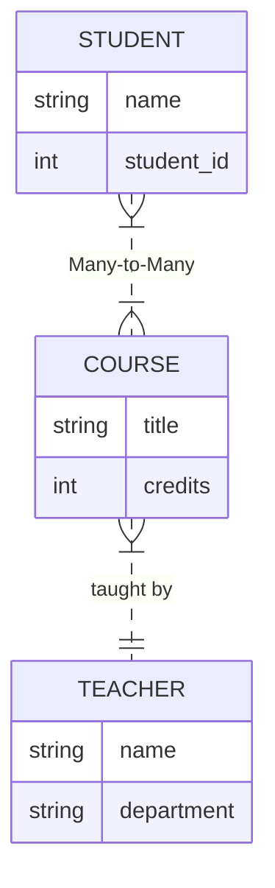

# 🗄️ Capítulo 2: Modelos de Datos (SQL vs NoSQL)

> **Basado en:** _Designing Data-Intensive Applications_ de Martin Kleppmann.
> **Nivel:** Fundamental
> **Serie:** De Senior a Staff Engineer

Este documento explora la "Guerra Santa" de las bases de datos. Desmitificamos que NoSQL es solo para "Big Data" y explicamos cómo la estructura de tus datos (y no solo la escala) debe dictar tu elección tecnológica.

[](https://youtu.be/cx_Tg5NdPcY)

---

## 1. 🧩 El Problema: Impedance Mismatch

**"El choque entre tus Objetos en memoria y tus Tablas en disco."**

La mayoría del desarrollo moderno se hace con Lenguajes Orientados a Objetos (Java, C#, JS/TS), pero las bases de datos SQL dominantes son Relacionales.

Esta desconexión obliga a usar capas de traducción (ORMs como Hibernate, Prisma, TypeORM) que a menudo ocultan ineficiencias graves.

### Ejemplo: El Perfil de Usuario (Bill Gates Resume)

En tu código (TypeScript/JSON), un perfil es un árbol continuo. En SQL, tienes que "despedazarlo".

```json
// Tu mente (y tu código) ve esto:
{
  "user_id": 1,
  "name": "Bill Gates",
  "positions": [
    { "company": "Microsoft", "year": 1975 },
    { "company": "Gates Foundation", "year": 2000 }
  ]
}
```

En SQL, esto requiere 3 tablas y JOINS complejos para reconstruirlo.

## 2. 📄 Modelo Documental (NoSQL)

"Ideal para datos que parecen un documento autocontenido."

Bases de datos como MongoDB, DynamoDB o Couchbase.

### Concepto Clave: Localidad del Dato

Si tu aplicación suele acceder a todo el árbol de datos a la vez (ej. cargar un perfil de LinkedIn), el modelo documental es superior porque almacena todo junto.

- **Ventaja**: Lectura rápida (1 seek en disco), esquema flexible.
- **Desventaja**: Malo para relaciones muchos-a-muchos complejas.

Cuándo usarlo (Regla del Pulgar):
Si tus datos se parecen a un Documento (facturas, currículums, configuraciones) donde rara vez necesitas partes aisladas, usa NoSQL.

## 🕸️ Modelo Relacional (SQL)

"El rey de las relaciones Muchos-a-Muchos."

Bases de datos como PostgreSQL, MySQL, Oracle.

### Concepto Clave: Normalización

La idea es eliminar la redundancia. Si el profesor de un curso cambia su nombre, solo lo actualizas en un lugar (tabla Teachers), no en los 5,000 documentos de estudiantes.



## 4. 🗣️ Consultas: Imperativas vs Declarativas

¿Por qué SQL ha sobrevivido 50 años? Porque es **Declarativo**.

### 🤖 Imperativo (El "CÓMO")

Le dices a la computadora paso a paso qué hacer.

- **Ejemplo:** Recorrer un array en JS, verificar una condición `if`, y hacer `push` a un nuevo array.
- **Problema:** Es difícil de optimizar y paralelizar automáticamente porque el orden de ejecución es estricto.

```javascript
// Código Imperativo (IMS / CODASYL style)
function getSharks(animals) {
  var sharks = [];
  for (var i = 0; i < animals.length; i++) {
    if (animals[i].family === "Sharks") {
      sharks.push(animals[i]);
    }
  }
  return sharks;
}
```

### Declarativo (El "Qué")

Le dices a la computadora qué resultado quieres, pero no cómo obtenerlo. El Optimizador de la Base de Datos decide la mejor ruta (usar índices, ordenar, paralelizar). Ejemplo (SQL o CSS):

```sql
SELECT * FROM animals WHERE family = 'Sharks';
```

**Analogía Frontend:**

- **Imperativo**: Manipulación del DOM con jQuery ($('div').addClass('active')).
- **Declarativo**: React (<div className={isActive ? 'active' : ''} />) o CSS (.menu:hover { color: red }). Tú defines el estado final, el navegador decide cómo pintar los pixeles.

## 5. Resumen

### Resumen: SQL vs NoSQL

| Caracteristica      | SQL - Relacional                                                                                         | NoSQL - Documental                                                                                               |
| :------------------ | :------------------------------------------------------------------------------------------------------- | :--------------------------------------------------------------------------------------------------------------- |
| **Filosofia**       | **Normalización:** Los datos se separan en tablas                                                        | **Localidad:** Los datos se usan juntos                                                                          |
| **Estructura**      | **Schema-on-Write:**<br>- Esquema estricto, define tipos de datos antes de guardar, garantiza integridad | **Schema-on-Read:**<br>- Esquema flexible, código define la estructura al leer, ideal si los datos cambian mucho |
| **Relaciones**      | Fuertes                                                                                                  | Debiles                                                                                                          |
| **Desarrollo**      | **Impedancia Missmatch:** Choca con la POO - ORM                                                         | Neutral                                                                                                          |
| **Actualizaciones** | **Eficiente:** Cambia un dato y se actualiza en todos los otros lados                                    | **Riesgosa:** Un dato actualizado puede necesitar actualizar miles de documentos                                 |
| **Casos de Uso**    | Sistemas financieros, CRM, ERP, aplicaciones con muchas relaciones interconectadas.                      | Content Management (CMS), Perfiles de usuario, Catálogos de productos, Analytics en tiempo real.                 |

## 🧠 Preguntas de Mock Interview

### 1. ¿Qué es el "Impedance Mismatch" y cómo afecta el rendimiento?

**Respuesta:**
Es la desconexión fundamental entre cómo viven los datos en tu **Memoria** (Código) y cómo viven en el **Disco** (Base de Datos Relacional).

- **En tu Código (POO):** Los datos son grafos ricos y anidados (ej. un `Usuario` tiene un array de `Direcciones`).
- **En SQL (Relacional):** Los datos son tablas planas. Tienes que "despedazar" (shredding) el objeto para guardarlo.

**💥 Impacto en el Rendimiento:**

1.  **Latencia:** Reconstruir un objeto requiere múltiples `JOINS` costosos o múltiples consultas (Problema N+1).
2.  **Productividad:** Perdemos tiempo escribiendo capas de traducción (ORMs/Mappers) en lugar de lógica de negocio.

> **💡 Staff Insight:** "Las bases de datos NoSQL (Documentales) nacieron para resolver esto. Al guardar JSONs, eliminan el desajuste: lo que tienes en memoria es exactamente lo que guardas en disco. Ganas velocidad por pura **Localidad del Dato**."

---

### 2. Imperativo vs. Declarativo: ¿Por qué las DBs prefieren el Declarativo?

**Respuesta:**
La diferencia radica en el **Control de Flujo**:

- **Imperativo (El CÓMO):** Das instrucciones paso a paso. _"Itera lista X, si cumple Y, guarda en Z"_. (Ej. JS, Java, C++).
- **Declarativo (El QUÉ):** Describes el resultado final deseado, no los pasos. _"Dame los usuarios de Canadá"_. (Ej. SQL, CSS, React).

**¿Por qué SQL es Declarativo?**
Por la **Abstracción y Optimización**. El motor de la base de datos (_Query Optimizer_) decide la mejor estrategia sin que tú toques el código.

- Hoy puede usar un índice.
- Mañana, si la tabla crece, puede decidir hacer un _Full Table Scan_ o paralelizar en 16 núcleos.

> **💡 Staff Insight:** "Es la misma razón por la que **React** ganó en el Frontend. Tú declaras el estado final de la UI y React (el motor) decide cuál es la forma más eficiente de manipular el DOM. SQL hizo esto 40 años antes."

---

### 3. Diseño de Sistema: ¿SQL o NoSQL para un Carrito de Compras (Amazon Clone)?

**Respuesta:**
La elección ideal es **NoSQL** (Key-Value o Documental como DynamoDB/Redis).

**¿Por qué?**

1.  **🛒 Naturaleza del Dato:** El carrito es temporal y pertenece a una sola sesión. Rara vez necesitas hacer _analytics_ complejos en tiempo real sobre ellos.
2.  **⚡ Write Throughput (Escritura):** En picos de tráfico (Black Friday), millones de usuarios escriben simultáneamente. NoSQL permite escrituras O(1) por Key.
3.  **🛡️ Alta Disponibilidad:** Si el nodo principal falla, necesitas que el usuario siga comprando (incluso si hay conflictos eventuales). NoSQL maneja mejor la replicación multi-líder.

> **💡 Staff Insight:** "El paper original de **Amazon DynamoDB** nació precisamente por el carrito de compras. Las DBs relacionales (Oracle) no aguantaban la escala de escritura ni garantizaban el 'Always-on'.
>
> _Ojo:_ Para el **Historial de Pedidos** (datos financieros inmutables), sí usaría **SQL**."

## Recursos y referencias

- 🔗 Edgar F. Codd: "A Relational Model of Data for Large Shared Data Banks," Communications of the ACM, 1970. Link al Paper (ACM): doi.org/10.1145/362384.362685
- Pramod J. Sadalage and Martin Fowler: NoSQL Distilled. Addison-Wesley, 2012. Link al Libro: martinfowler.com/books/nosql.html
- [Postgres JSONB: The best of both worlds?](https://www.postgresql.org/docs/current/datatype-json.html)
